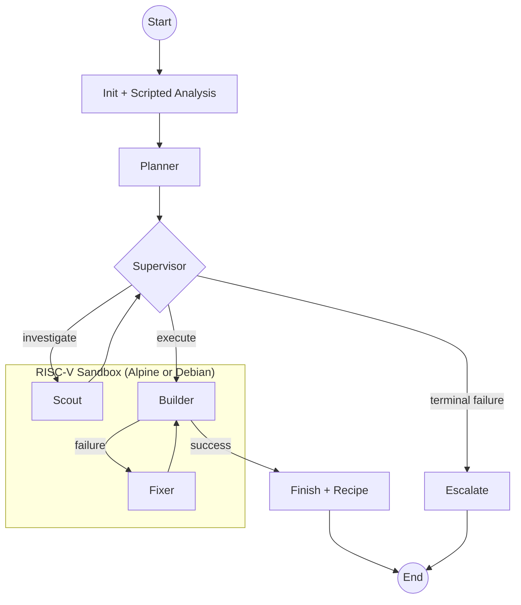

# Atesor AI

**A multi-agent system that autonomously ports x86/ARM packages to RISC-V (riscv64).**

[](https://opensource.org/licenses/MIT)
[](https://www.python.org/downloads/)
[](https://github.com/langchain-ai/langgraph)

Atesor AI takes a source code url (i.e GitHub repo link), builds the package natively inside a RISC-V Docker sandbox, fixes whatever breaks, and emits a reproducible porting recipe. Supported build systems cover the **C, C++, and Go** ecosystems (Make, CMake, Meson, autotools, Cargo, Go modules), more are coming.. It runs across both **Alpine (musl)** and **Debian/Ubuntu (glibc)** sandboxes (and native/real RISC-V hardware support is coming too..), so a package is verified on the two libc families that matter in practice.

**NOTE**: Native builds (on real RISC-V hardware) is in process and will be added in a future release. For now, QEMU/binfmt emulation is used for all builds. (see TODO)

---

## Table of Contents

- [Why](#why)
- [How it works](#how-it-works)
- [Quick start](#quick-start)
- [Usage](#usage)
- [Architecture](#architecture)
- [Configuration](#configuration)
- [Outputs](#outputs)
- [Key features](#key-features)
- [Development](#development)
- [Project layout](#project-layout)
- [Contributing](#contributing)

---

## Why

The RISC-V software ecosystem still has gaps that x86 and ARM solved years ago. Porting work is repetitive: clone, detect the build system, install the right packages, hit the same handful of issues (stale `config.guess`, x86-only SIMD, Go's `-buildvcs` trap, musl vs glibc headers and many more), patch, retry. Atesor AI automates that loop with a small team of specialized LLM agents and a deterministic scripted-ops layer that handles the boring up to 70% for free.

Output is a reproducible Markdown recipe a human or CI can replay, plus the ready-to-use RISC-V build artifacts.

---

## How it works

1. **Scripted analysis** clones the repo inside the sandbox and detects the build system, dependencies, and architecture-specific code — zero LLM cost.
2. **Planner** drafts a high-level `TaskPlan` from that analysis.
3. **Supervisor** routes work between Scout, Builder, and Fixer, watches for error loops, and decides when to escalate.
4. **Builder** runs the build natively on RISC-V via QEMU/binfmt. **Fixer** patches whatever breaks. **Scout** answers targeted questions about the source tree.
5. **Artifact scanner** verifies the produced binaries are real `riscv64` ELF files — not silent x86 fallthroughs.
6. **Recipe** is written to disk and cached, keyed by `(package, sandbox)`.

The supervisor → executor loop is built on [LangGraph](https://github.com/langchain-ai/langgraph), with a single `AgentState` carried between nodes.

---

## Quick start

### Prerequisites

- Docker, with RISC-V emulation enabled on x86/ARM hosts:
  ```bash
  docker run --privileged --rm tonistiigi/binfmt --install all
  ```
- Python 3.10+
- An API key for one of: Gemini, OpenAI, or OpenRouter.

### Install

```bash
git clone https://github.com/akifejaz/atesor-ai
cd atesor-ai
pip install -r requirements.txt
cp .env-example .env   # then add your API key
```

### Build the sandbox

```bash
python3 main.py --setup-only                       # Alpine (default)
python3 main.py --setup-only --platform debian     # Debian/Ubuntu
```

### Port a package

```bash
python3 main.py --repo https://github.com/madler/zlib --verbose
```

---

## Usage

```bash
# Single repo, default sandbox (Alpine)
python3 main.py --repo <github_url>

# Force a clean run, ignore the recipe cache
python3 main.py --repo <github_url> --force --max-attempts 8

# Target the Debian sandbox
python3 main.py --repo <github_url> --platform debian

# Pin a specific container (used by the batch runner)
python3 main.py --repo <github_url> --container atesor-ai-sandbox-w0

# Batch — parallel across N worker containers
python3 batch_test.py                              # uses list-packages.txt
python3 batch_test.py --workers 2 pkg1 pkg2

# Maintenance
python3 main.py --cleanup --clean-image            # tear down sandbox
python3 main.py --clean-workspace                  # prune workspace/
```


---

## Architecture (high-level)



**Three pillars:**

- **Scripted Operations Layer** (`src/scripted_ops.py`) — deterministic, zero-LLM repo inspection. Handles ~70% of analysis at zero cost.
- **Multi-agent core** (`src/graph.py`) — Planner, Supervisor, Scout, Builder, Fixer, Finish, Escalate. Every node is wrapped with `@agent_node` for uniform error handling, audit logging, and rate-limit retry.
- **Platform abstraction** (`src/platforms.py`) — one `PlatformProfile` per distro. Adding a new sandbox is a single PROFILES entry; the rest of the code is distro-agnostic.

State flows through a single `AgentState` object (`src/state.py`) that carries plan, build status, error history, fix attempts, cost counters, and the audit trail.

---

## Configuration

Edit `.env` (template in `.env-example`):

| Variable | Required when | Purpose |
|---|---|---|
| `LLM_PROVIDER` | always | `gemini` (default), `openai`, `openrouter` |
| `GOOGLE_API_KEY` | provider = `gemini` | |
| `OPENAI_API_KEY` | provider = `openai` | |
| `OPENROUTER_API_KEY` | provider = `openrouter` | |
| `LANGCHAIN_API_KEY` + `LANGCHAIN_TRACING_V2` | optional | LangSmith tracing |
| `ATESOR_PLATFORM` | optional | `alpine` / `debian` (overridden by `--platform`) |
| `ATESOR_CONTAINER` | optional | Override container name (overridden by `--container`) |

Models are selected per agent role in `src/models.py` (`MODEL_CONFIG`). Each role has its own temperature — deterministic for Builder/Supervisor, slightly hotter for Fixer.

---

## Outputs

| Path | Content |
|---|---|
| `workspace/output/{repo}_report_*.md` | Final Markdown porting recipe |
| `workspace/output/{repo}_state_*.json` | Full `AgentState` snapshot |
| `workspace/logs/agent_{repo}.log` | Per-repo DEBUG log |
| `workspace/logs/agent-call_{repo}.log` | Full LLM call audit trail (prompt + response + cost) |
| `data/recipe_cache.json` | Successful builds, keyed by `{package: {sandbox: recipe}}` |
| `data/examples/*.json` | Few-shot examples per agent (auto-learning enabled) |

A cache hit short-circuits the pipeline — no LLM calls, no Docker work — unless `--force` is set. Cache entries are per-sandbox; Alpine and Debian builds populate separate keys.

---

## Key features

- **Native RISC-V builds** — no cross-compilation, no surprises at deploy time.
- **Multiple Build Systems** — Make, CMake, Meson, autotools, Cargo, Go modules. More are coming.
- **Parallel batch runs** — `batch_test.py` allocates one container per worker (`atesor-ai-sandbox-w0..wN`) to avoid `apk`/`apt` lock contention.
- **Few-shot memory** — agents learn from past successes; up to 100 examples per agent, retrieved by keyword/regex.
- **Recipe cache** — successful builds are replayable and skip the LLM entirely.
- **ELF verification** — every produced binary is checked with `file` to confirm `RISC-V ELF`.
- **Cost-aware** — every LLM call is logged with token estimate and cost; hard cap at $1.00 per package.
- **Safe execution** — every shell command goes through a regex whitelist and runs inside the sandbox.

---

## Development

```bash
# Run the full test suite (PYTHONPATH=. is required)
PYTHONPATH=. pytest

# Single file or test case
PYTHONPATH=. pytest tests/test_graph_routing.py
PYTHONPATH=. pytest tests/test_state.py::TestState::test_add_error
```

Style: PEP 8, 79-char lines, Google-style docstrings, type hints on public APIs. See [CONTRIBUTING.md](CONTRIBUTING.md) for the full contributor guide.

---

## Project layout

```
main.py                  start, setup, CLI, config, recipe cache management

src/
  graph.py               LangGraph workflow: nodes, prompts, routing
  state.py               AgentState + enums + error classification
  scripted_ops.py        Zero-LLM repo analysis
  tools.py               Sandboxed shell execution + patch application
  platforms.py           PlatformProfile (Alpine, Debian, Ubuntu)
  models.py              LLM provider factory, per-role config
  memory.py              Few-shot retrieval, auto-learning, recipe cache
  knowledge.py           Static RISC-V / distro porting knowledge
  artifact_scanner.py    ELF inspection (verify riscv64 binaries)
  artifact_curator.py    Rank artifacts into primary/secondary/noise
  llm_logger.py          LLM call audit log (singleton)
  llm_helpers.py         Timeout wrapper, JSON extraction, validation
  config.py              Env-aware workspace paths; Docker auto-detect

data/
  recipe_cache.json      Successful-build registry (per-sandbox)
  examples/*.json        Few-shot examples per agent

tests/                   unittest-style suite, one file per module
```

---

## Contributing

Contributions are welcome — especially new platform profiles, additional few-shot examples from real porting runs, and bug reports for packages that fail in interesting ways. See [CONTRIBUTING.md](CONTRIBUTING.md) for setup, coding standards, and how to extend the system.

- [Open an issue](https://github.com/akifejaz/atesor-ai/issues)
- [License: MIT](LICENSE)

Built for the RISC-V community. Making the ecosystem catch up, one package at a time.
