# Atesor AI: Smart Multi-stage Agentic System for RISC-V Software Porting 🚀

[](https://opensource.org/licenses/MIT)
[](https://www.python.org/downloads/)
[](https://github.com/langchain-ai/langgraph)

---

## Overview

Atesor AI is a state-of-the-art **multi-agent AI system** designed to automate the complex process of porting software packages from x86/ARM to RISC-V architecture. Built on modern agentic design patterns and powered by LangGraph, it intelligently handles analysis, compilation, and error correction in a secure sandbox.

---

## Architecture & Workflow

Atesor AI follows a hierarchical design where high-level agents plan and supervise, while specialized agents execute and fix.

### Agent Workflow Diagram

```mermaid
graph TD
    Start((Start)) --> Init[Initialization]
    Init --> Planner[Strategic Planner]
    Planner --> Supervisor{Supervisor}
    
    Supervisor -->|Plan Next| Scout[Scout Agent]
    Scout --> Supervisor
    
    Supervisor -->|Execute Build| Builder[Builder Agent]
    Builder -->|Failure| Fixer[Fixer Agent]
    Fixer -->|Retry Build| Builder
    
    Builder -->|Success| Summarizer[Summarizer Agent]
    Summarizer --> End((End))
    
    Supervisor -->|Escalate| Escalation[Human Interv.]
    Escalation --> End


    subgraph OpsLayer ["Scripted Operations Layer (Zero-Cost)"]
        Init
    end

    subgraph Sandbox ["Secure Sandbox"]
        direction TB
        Scout
        Builder
        Fixer
    end

    %% Styling
    style Sandbox fill:#1a1a1a,stroke:#555,stroke-dasharray: 5 5
    style OpsLayer fill:#1a1a1a,stroke:#555,stroke-dasharray: 5 5
    style Supervisor fill:#1a1a1a,stroke:#555,stroke-dasharray: 5 5
```




## Technical Deep Dive

### 1. State-Driven Orchestration (LangGraph)
Atesor AI leverages **LangGraph** to implement a cyclic, state-driven workflow. Unlike linear pipelines, our architecture allows the system to:
- **Loop back** from failure to specialized fixing nodes.
- **Refine plans** dynamically as more information is gathered by the Scout.
- **Maintain a persistent audit trail** of every command executed and decision made.

### 2. The Multi-Agent Intelligence
- **The Planner** acts as the architect, creating a high-level roadmap (`TaskPlan`) that guides the entire process.
- **The Supervisor** acts as the quality controller, verifying agent outputs for hallucinations and routing the state to the most appropriate node.
- **The Sandbox Agents** (Scout, Builder, Fixer) operate exclusively within the Docker environment, ensuring host safety and environmental consistency.

### 3. Cost-Effective Intelligence
By offloading deterministic tasks (like dependency tree parsing and build system detection) to the **Scripted Operations Layer**, we reduce the context window requirements and the total number of LLM invocations. This specialized layer handles ~70% of the non-critical decision path, allowing the LLMs to focus purely on complex problem-solving and patch generation.

---

## Quick Start

### Prerequisites

- Docker installed and running.
- **Cross-Platform Support**: If you are on an x86 host, you must enable RISC-V emulation via `binfmt`:
  ```bash
  docker run --privileged --rm tonistiigi/binfmt --install all
  ```
- API key for an LLM provider (OpenAI, Gemini, or OpenRouter).

### Installation

```bash
# Clone the repository
git clone https://github.com/akifejaz/atesor-ai
cd atesor-ai

# Install dependencies
pip install -r requirements.txt

# Set up environment variables
cp .env-example .env
# Edit .env and add your API keys
```

### Basic Usage

```bash
# 1. Prepare the RISC-V Sandbox
python3 main.py --setup-only

# 2. Start Porting a Package
python3 main.py --repo https://github.com/madler/zlib --verbose

# 3. Force a clean rebuild with custom attempt limit
python3 main.py --repo https://github.com/madler/zlib --force --max-attempts 8
```

| Flag | Default | Description |
|------|---------|-------------|
| `--repo URL` | *required* | GitHub repository URL to port |
| `--verbose` | `false` | Enable DEBUG logging to console |
| `--setup-only` | `false` | Initialize sandbox without porting |
| `--max-attempts` | `5` | Maximum fix attempts before escalation |
| `--force` | `false` | Force fresh clone and rebuild |

---

## Few-Shot Learning System

Atesor AI includes a **lightweight memory system** that provides few-shot examples to agents, improving their accuracy without increasing API costs significantly.

### How It Works

1. **Example Dataset**: Curated examples stored in `data/examples/` for each agent type:
   - `scout_examples.json` - Build plan generation patterns
   - `fixer_examples.json` - Error resolution strategies
   - `builder_examples.json` - Build execution examples

2. **Smart Retrieval**: The system uses keyword-based matching to find relevant examples:
   - Matches build system (go, cmake, make)
   - Matches error patterns
   - Considers project structure (main path, module directory)

3. **Prompt Integration**: Selected examples are formatted and included in agent prompts, providing context without requiring full vector database infrastructure.

### Adding New Examples

To add examples from your successful porting sessions:

```bash
# Edit the appropriate examples file
vim data/examples/scout_examples.json

# Test the examples
python -c "from src.memory import format_few_shot_examples; print(format_few_shot_examples('scout', {'build_system': 'go'}))"
```

See `data/examples/README.md` for detailed instructions on formatting examples.

### Benefits

- **Up to 100 examples per agent** with automatic pruning of oldest entries
- **No vector DB required** - lightweight keyword matching
- **~2000 chars per prompt** - minimal token overhead
- **Easy to extend** - JSON format, no code changes needed
- **Auto-learning** - successful porting runs save novel patterns back to examples automatically

---

## Artifact Scanning & Verification

After each build, the `ArtifactScanner` (`src/artifact_scanner.py`) automatically:
- Discovers executables, static libraries (`.a`), and shared libraries (`.so`) in the build directory
- Runs `file` on each artifact to verify it is a genuine **RISC-V ELF** binary
- For static archives, extracts object files and checks their architecture
- Reports a pass/fail summary used by the supervisor to decide next steps

---

## LLM Call Audit Logging

Every LLM invocation is logged to `workspace/logs/agent-call.log` via the `LLMCallLogger` singleton (`src/llm_logger.py`). Each entry includes:
- Call ID, timestamp, agent role, model name
- Cost estimate and prompt/response lengths
- First 10k characters of prompt and response

This provides a full audit trail for debugging and cost analysis.

---

## Error Classification & Severity

The system categorizes build errors into structured types (`ErrorCategory` in `src/state.py`):

`DEPENDENCY` · `COMPILATION` · `LINKING` · `ARCHITECTURE` · `NETWORK` · `CONFIGURATION` · `MISSING_TOOLS` · `PERMISSION` · `ARCHITECTURE_IMPOSSIBLE` · and more

Each error is assigned a `FailureSeverity` (LOW / MEDIUM / HIGH). The supervisor uses error history and loop detection (3+ same-category errors) to decide whether to retry, fix, or escalate.

---

## Development & Testing

Run the automated unit tests to ensure system integrity:

```bash
# Run all tests
PYTHONPATH=. pytest

# Run a single test file
PYTHONPATH=. pytest tests/test_graph_routing.py

# Run a single test case
PYTHONPATH=. pytest tests/test_state.py::TestState::test_add_error
```

---

## Configuration

The system is environment-aware and supports multiple LLM providers:

- **Config**: `src/config.py` automatically handles workspace paths between Docker and Host.
- **Models**: `src/models.py` manages model selection and cost tracking.
- **Security**: Commands are validated against a whitelist in `src/tools.py` before execution.

### Environment Variables

| Variable | Purpose |
|----------|---------|  
| `LLM_PROVIDER` | `gemini` (default), `openai`, or `openrouter` |
| `GOOGLE_API_KEY` | Required for Gemini |
| `OPENAI_API_KEY` | Required for OpenAI |
| `OPENROUTER_API_KEY` | Required for OpenRouter |
| `LANGCHAIN_API_KEY` | Optional — LangSmith tracing |
| `LANGCHAIN_TRACING_V2` | Set to `true` to activate tracing |

### Output Locations

| Path | Content |
|------|---------|  
| `workspace/output/{repo}_report_*.md` | Markdown porting guide |
| `workspace/output/{repo}_state_*.json` | Full state snapshot |
| `workspace/logs/agent.log` | DEBUG-level agent log |
| `workspace/logs/agent-call.log` | LLM call audit trail |

---

## Project Structure

- `main.py`: Entry point for CLI and Docker management.
- `src/graph.py`: The core LangGraph state machine (all agent nodes + routing).
- `src/scripted_ops.py`: Zero-cost analysis and repo management.
- `src/state.py`: Global process tracking, error classification, and data structures.
- `src/tools.py`: Safe command execution and file utilities.
- `src/memory.py`: Few-shot learning system with auto-learning.
- `src/config.py`: Environment-aware workspace path resolution.
- `src/models.py`: LLM provider factory and per-role model configuration.
- `src/knowledge.py`: Static RISC-V / Alpine knowledge base.
- `src/artifact_scanner.py`: Post-build artifact detection and RISC-V verification.
- `src/llm_logger.py`: LLM call audit trail logging.
- `data/examples/`: Curated few-shot examples per agent type.
- `data/recipe_cache.json`: Cache of successfully ported package recipes.
- `tests/`: Automated unit tests for engine logic.

---

## Contributing & Support

We welcome contributions to the RISC-V ecosystem! 
- [Open an Issue](https://github.com/akifejaz/atesor-ai/issues)
- [Project License](LICENSE)

**Built with ❤️ for the RISC-V community**

*Making RISC-V software ecosystem as rich as x86/ARM, one package at a time.*
