# Atesor AI: Smart Multi-stage Agentic System for RISC-V Software Porting 🚀

[](https://opensource.org/licenses/MIT)
[](https://www.python.org/downloads/)
[](https://github.com/langchain-ai/langgraph)

---

## Overview

Atesor AI is a state-of-the-art **multi-agent AI system** designed to automate the complex process of porting software packages from x86/ARM to RISC-V architecture. Built on modern agentic design patterns and powered by LangGraph, it intelligently handles analysis, compilation, and error correction in a secure sandbox.

---

## Architecture & Workflow

Atesor AI follows a hierarchical design where high-level agents plan and supervise, while specialized agents execute and fix.

### Agent Workflow Diagram

```mermaid
graph TD
    Start((Start)) --> Init[Initialization]
    Init --> Planner[Strategic Planner]
    Planner --> Supervisor{Supervisor}
    
    Supervisor -->|Plan Next| Scout[Scout Agent]
    Scout --> Supervisor
    
    Supervisor -->|Execute Build| Builder[Builder Agent]
    Builder -->|Failure| Fixer[Fixer Agent]
    Fixer -->|Retry Build| Builder
    
    Builder -->|Success| Summarizer[Summarizer Agent]
    Summarizer --> End((End))
    
    Supervisor -->|Escalate| Escalation[Human Interv.]
    Escalation --> End


    subgraph OpsLayer ["Scripted Operations Layer (Zero-Cost)"]
        Init
    end

    subgraph Sandbox ["Secure Sandbox"]
        direction TB
        Scout
        Builder
        Fixer
    end

    %% Styling
    style Sandbox fill:#1a1a1a,stroke:#555,stroke-dasharray: 5 5
    style OpsLayer fill:#1a1a1a,stroke:#555,stroke-dasharray: 5 5
    style Supervisor fill:#1a1a1a,stroke:#555,stroke-dasharray: 5 5
```




## Technical Deep Dive

### 1. State-Driven Orchestration (LangGraph)
Atesor AI leverages **LangGraph** to implement a cyclic, state-driven workflow. Unlike linear pipelines, our architecture allows the system to:
- **Loop back** from failure to specialized fixing nodes.
- **Refine plans** dynamically as more information is gathered by the Scout.
- **Maintain a persistent audit trail** of every command executed and decision made.

### 2. The Multi-Agent Intelligence
- **The Planner** acts as the architect, creating a high-level roadmap (`TaskPlan`) that guides the entire process.
- **The Supervisor** acts as the quality controller, verifying agent outputs for hallucinations and routing the state to the most appropriate node.
- **The Sandbox Agents** (Scout, Builder, Fixer) operate exclusively within the Docker environment, ensuring host safety and environmental consistency.

### 3. Cost-Effective Intelligence
By offloading deterministic tasks (like dependency tree parsing and build system detection) to the **Scripted Operations Layer**, we reduce the context window requirements and the total number of LLM invocations. This specialized layer handles ~70% of the non-critical decision path, allowing the LLMs to focus purely on complex problem-solving and patch generation.

---

## Quick Start

### Prerequisites

- Docker installed and running.
- API key for an LLM provider (OpenAI, Gemini, or OpenRouter).

### Installation

```bash
# Clone the repository
git clone https://github.com/akifejaz/atesor-ai
cd atesor-ai

# Install dependencies
pip install -r requirements.txt

# Set up environment variables
cp .env.example .env
# Edit .env and add your API keys
```

### Basic Usage

```bash
# 1. Prepare the RISC-V Sandbox
python3 main.py --setup-only

# 2. Start Porting a Package
python3 main.py --repo https://github.com/madler/zlib --verbose
```

---

## Configuration

The system is environment-aware and supports multiple LLM providers:

- **Config**: `src/config.py` automatically handles workspace paths between Docker and Host.
- **Models**: `src/models.py` manages model selection and cost tracking.
- **Security**: Commands are validated against a whitelist in `src/tools.py` before execution.

---

## Project Structure

- `main.py`: Entry point for CLI and Docker management.
- `src/graph.py`: The core LangGraph state machine.
- `src/scripted_ops.py`: Zero-cost analysis and repo management.
- `src/state.py`: Global process tracking and data structures.
- `src/tools.py`: Safe command execution and file utilities.
- `tests/`: Automated unit tests for engine logic.

---

## Contributing & Support

We welcome contributions to the RISC-V ecosystem! 
- [Open an Issue](https://github.com/akifejaz/atesor-ai/issues)
- [Project License](LICENSE)

**Built with ❤️ for the RISC-V community**

*Making RISC-V software ecosystem as rich as x86/ARM, one package at a time.*
